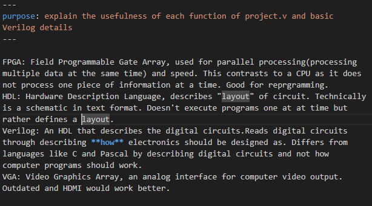

09-19-2025 10:00pm-11:pm
Today, I looked at the Bitstream website. I realized that it would be really cool to learn a new hardware "language", Verilog, and more about FPGAs rather than Arduino code. I looked around the website, and learned about the digital circuits and how they work. 
I also started working on the project.v, up until step 9. I didn't fully get it, and so I started writing comments that would help me remember the functions of each step

09-19-2025 08:45pm- 10:00pm
Today, I continued off step 9, and created a whatisthis.md file to help me understand what each basic concept means. It wasn't a lot of fun. 

09-20-2025 10:39pm - 11:20pm
I added more to code. Still trying to understand it :(
I did, however, learn that Verilog is a magic black box that does something to the FPGA. 

09-26-2025 6:50pm -
I added more to code
fun!